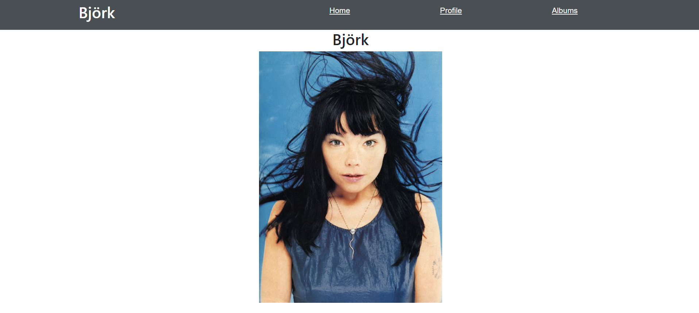
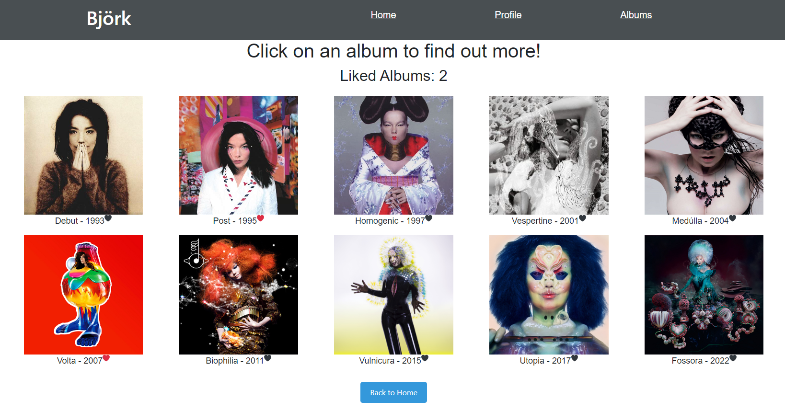

# Music App using React
Website using React. The website contains multiple components (`Home`, `Profile`, `Albums`, `SingleAlbum` and `LikeNumber`). Routes are used to allow users to navigate between pages. On the home page, `useEffect` is used to alternate the picture shown. On the Albums page, The user can also click on an album cover and a tab with the wikipedia page for that album will open. `useNavigate` is used to implement the 'Back' button on this page. The user is also able to like albums by clicking on the heart image, which will turn red once liked. The 'liked albums' feature on the album page was created in order to practice Redux. Liking and un-liking a heart changes a value in the store. The `LikeNumber` component reads this value and displays it (e.g. as `Liked Albums: 2`).

## Installation
- Clone the repository.
- Call `npm i` in the terminal.
- Call `npm run dev` in the terminal. A URL should be displayed in the terminal (i.e. `http://localhost:5173`).
- Go to that URL in the browser.

## Bugs
- (Fixed by adding a conditional statement in `SingleAlbum.jsx`) For some albums, clicking on the album cover doesn't lead to the correct wikipedia page. This is because wikipedia's URLs aren't uniform.

