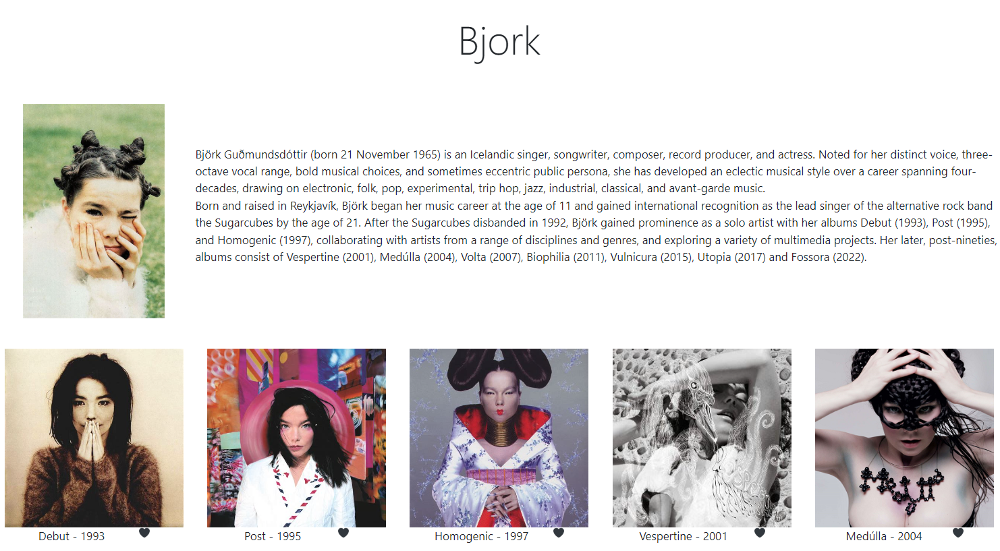

# Music App using React
Website using React. The website contains multiple components (Home, Profile, Albums, and SingleAlbum). Routes are used to allow users to navigate between pages. On the Albums page, the user is able to like albums by clicking on the heart image, which will turn red once liked. The user can also click on an album cover and a tab with the wikipedia page for that album will open. useNavigate is used to implement the 'Back' button on this page. On the home page, useEffect is used to alternate the picture shown

## Installation
- Clone the repository.
- Call `npm i` in the terminal.
- Call `npm run dev` in the terminal. A URL should be displayed in the terminal (i.e. `http://localhost:5173`).
- Go to that URL in the browser.

## Bugs
- For some albums, clicking on the album cover doesn't lead to the correct wikipedia page. This is because wikipedia's URLs aren't uniform.

